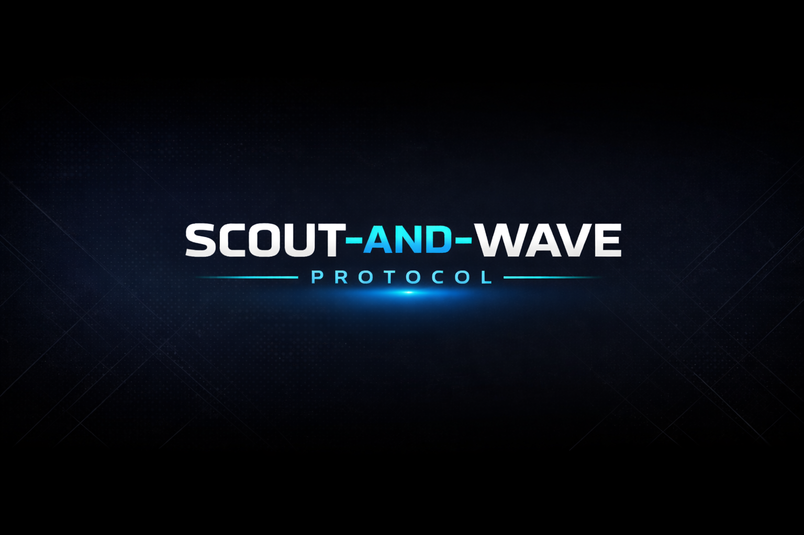
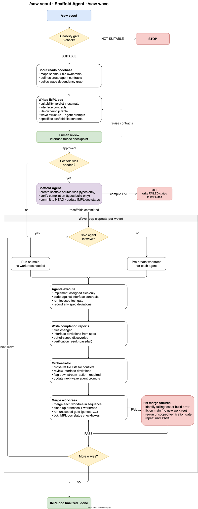

# Polywave

<p align="center">
  
</p>

[](https://github.com/blackwell-systems)

[](https://agentskills.io)

**Parallel AI agents that don't break each other's code.**

Other multi-agent frameworks run fast and merge chaos. Polywave gives every agent its own worktree, assigns every file to exactly one agent, and shows you the full plan before any agent touches your code. Conflicts are resolved at planning time, not at merge time.

> Published as an [Agent Skill](https://agentskills.io) (open standard). Compatible with Claude Code, Cursor, GitHub Copilot, and other Agent Skills-compatible tools.

> **New to Polywave?**
> 1. Read this README (15 min)
> 2. Read [QUICKSTART.md](implementations/claude-code/QUICKSTART.md) (20 min) for a worked example
> 3. Try it: `/polywave scout "feature"` on a test project
> 4. Deep dive: [polywave-protocol](https://github.com/blackwell-systems/polywave-protocol) for the full specification

## Why

You've run parallel agents before. You know what happens: two agents edit the same file, the merge produces garbage, and you spend longer fixing it than if you'd done the work sequentially. Or worse, the merge succeeds silently because both agents touched different functions in the same file, but they made contradictory assumptions about shared state. You find out at runtime.

Most frameworks try to solve this with better prompts. Polywave solves it with structure:

- **Disjoint file ownership.** The Scout assigns every file to exactly one agent before any code is written. Two agents in the same wave cannot produce edits to the same file. Merge conflicts become structurally impossible.
- **Per-agent worktree isolation.** Each agent works in its own git worktree, a separate directory with an independent file tree. Concurrent builds, tests, and tool-cache writes don't race on shared state.
- **Human review before execution.** You see the full plan (file assignments, interface contracts, wave structure) and approve it before any agent launches. This is the last point where changing the architecture is cheap.
- **Suitability gate.** Polywave says "no" when the work doesn't decompose cleanly. A poor-fit assessment prevents bad decompositions from producing expensive failures.

The system has seven [participant roles](https://github.com/blackwell-systems/polywave-protocol/blob/main/participants.md), but you interact with two: the **Orchestrator** (your Claude Code session, coordinates everything) and the **Scout** (analyzes codebase, assigns files, writes the plan). The other five (Scaffold Agent, Wave Agents, Integration Agent, Critic Agent, Planner) run automatically when needed.

## How

**What happens when you run Polywave:**

1. You run `/polywave scout "feature"` -> Scout analyzes codebase, assigns files to agents
2. Scout writes IMPL doc (a YAML coordination artifact that defines file ownership, interface contracts, and wave structure) -> You review the wave structure
3. You run `/polywave wave` -> Scaffold Agent creates scaffold files if needed
4. Wave Agents launch in parallel -> Each works in isolated worktree on disjoint files
5. Orchestrator merges -> Runs tests -> Cleans up worktrees

**Key mechanisms:**

- **Orchestrator:** Synchronous coordination agent in your session. Launches agents, enforces file ownership, executes merge procedure, runs verification gates.

- **Scout:** Asynchronous agent. Analyzes codebase, produces IMPL doc with dependency graph, interface contracts, file ownership table, and wave structure. Every file assigned to exactly one agent.

- **Scaffold Agent:** Runs once before Wave 1 if shared types are needed. Creates shared type files from IMPL doc contracts, verifies compilation, commits to HEAD.

- **Wave Agents:** Asynchronous agents running in parallel. Each owns disjoint files, implements against frozen interface contracts, runs verification gate, commits work, writes completion report.

- **Integration Agent:** Runs after wave merge. Wires new exports from wave agents into caller code. Non-fatal; gaps are reported to the human if wiring fails.

The protocol has a built-in **suitability gate** that answers [five questions](https://github.com/blackwell-systems/polywave-protocol/blob/main/preconditions.md) before producing any agent prompts. If preconditions don't hold, the scout emits NOT SUITABLE and stops.

<picture>
  <source media="(prefers-color-scheme: dark)" srcset="assets/diagrams/polywave-scout-wave-dark.svg">
  
</picture>

## Quick Start

**Prerequisites:** Git 2.20+, jq 1.6+, Claude Code. You do not need polywave-protocol or polywave-web.

```bash
# 1. Install skill files, hooks, and Agent permission
git clone https://github.com/blackwell-systems/polywave.git ~/code/polywave
~/code/polywave/install.sh    # configures Agent permission, symlinks skills, installs hooks

# 2. Install polywave-tools CLI (the skill orchestrates; the CLI executes)
brew install blackwell-systems/tap/polywave-tools                                     # Homebrew
go install github.com/blackwell-systems/polywave-go/cmd/polywave-tools@latest   # Go install
# Or download binary: https://github.com/blackwell-systems/polywave-go/releases/latest

# 3. Initialize your project
cd your-project
polywave-tools init            # auto-detects language, build, and test commands

# 4. Verify
polywave-tools verify-install  # checks skill files, CLI, hooks, permissions
```

**5. Restart Claude Code**, then run your first scout:

```bash
/polywave scout "add a caching layer to the API client"
```

**Subcommands:**

| Command | Purpose |
|---------|---------|
| `/polywave scout "<feature>"` | Analyze codebase, produce IMPL doc |
| `/polywave wave` | Execute next pending wave |
| `/polywave wave --auto` | Execute all remaining waves unattended |
| `/polywave auto "<feature>"` | Scout + confirm + wave in one command |
| `/polywave status` | Show current wave and agent progress |
| `/polywave bootstrap "<project>"` | Design new project structure from scratch |
| `/polywave interview "<description>"` | Structured requirements gathering |
| `/polywave program --impl <slug> ...` | Bundle queued IMPLs into a parallel program |
| `/polywave program plan/execute/status/replan` | Multi-feature planning and tier-gated execution |
| `/polywave amend --add-wave/--redirect-agent/--extend-scope` | Modify active IMPL |

**First time using Polywave?** See [QUICKSTART.md](implementations/claude-code/QUICKSTART.md) for step-by-step guidance with example output.

## Repositories

| Repository | Purpose |
|-----------|---------|
| [polywave-protocol](https://github.com/blackwell-systems/polywave-protocol) | Protocol specification: invariants, execution rules, state machine, message formats |
| **polywave** (this repo) | Claude Code implementation: Agent Skill, hooks, prompts, agent templates |
| [polywave-go](https://github.com/blackwell-systems/polywave-go) | Go engine, Protocol SDK, and `polywave-tools` CLI |
| [polywave-web](https://github.com/blackwell-systems/polywave-web) | Web UI and HTTP/SSE server |

## When to Use It

Polywave pays for itself when the work has clear file seams, interfaces can be defined before implementation starts, and each agent owns enough work to justify running in parallel. The build/test cycle being >30 seconds amplifies the savings further.

If the work doesn't decompose cleanly, the Scout says so. It runs a suitability gate first and emits NOT SUITABLE rather than forcing a bad decomposition.

## How Parallel Safety Works

Polywave enforces two independent constraints that together make parallel execution correct:

**Disjoint file ownership** prevents merge conflicts. Every file that will change is assigned to exactly one agent in the IMPL doc. No two agents in the same wave can produce edits to the same file, so the merge step is always conflict-free.

**Worktree isolation** prevents execution-time interference. Each agent works in its own git worktree, a separate directory that shares the same git history but has an independent file tree. Concurrent builds, tests, and tool-cache writes don't race on shared state.

Neither constraint substitutes for the other. Disjoint ownership without worktrees: merge is safe, but concurrent builds are flaky. Worktrees without disjoint ownership: execution is clean, but merge produces unresolvable conflicts. Both must hold.

### Worktree Isolation Defense (6 layers)

Agents don't always respect isolation instructions. Polywave treats worktree isolation as an infrastructure problem, not a cooperation problem, with hook-based enforcement (E43) as the primary mechanism.

| Layer | Mechanism | Type |
|-------|-----------|------|
| **E43** | **Hook-based enforcement**: Claude Code lifecycle hooks (SubagentStart, PreToolUse:Bash, PreToolUse:Write/Edit, SubagentStop) automatically inject environment variables, prepend cd commands to bash calls, and block out-of-bounds writes at the tool boundary. Violations become impossible rather than merely detected. | **Prevention (Primary)** |
| 0 | **Pre-commit hook**: installed automatically by `polywave-tools create-worktrees`. Blocks commits to main during active waves. Orchestrator bypasses via `POLYWAVE_ALLOW_MAIN_COMMIT=1`. | Prevention |
| 1 | **Manual worktree pre-creation**: Orchestrator creates all worktrees before any agent launches | Deterministic |
| 2 | **`isolation: "worktree"` parameter**: each agent launch specifies worktree isolation at the tool level | Tool-level |
| 3 | **Field 0 self-verification**: agents confirm branch via brief check (primary enforcement is the `validate_worktree_isolation` SubagentStart hook) | Cooperative |
| 4 | **Merge-time trip wire**: Orchestrator counts commits per worktree branch before merging. Zero commits = isolation failure. Stops with recovery options. | Deterministic |

## Polywave-Teams (Experimental)

[`docs/proposals/polywave-teams/`](docs/proposals/polywave-teams/) is an alternate execution layer using Claude Code Agent Teams. Same protocol, same IMPL doc, same Scout. Different wave plumbing: teammates replace background Agent tool calls, providing inter-agent messaging and real-time deviation alerts.

## Blog Post

Four-part series on the pattern, the lessons learned from dogfooding it, and how the protocol evolved:

1. [Polywave: A Coordination Pattern for Parallel AI Agents](https://blog.blackwell-systems.com/posts/scout-and-wave/). The pattern: failure modes of naive parallelism, the scout deliverable, wave execution, and a worked example from brewprune.
2. [Polywave, Part 2: What Dogfooding Taught Us](https://blog.blackwell-systems.com/posts/scout-and-wave-part2/). The audit-fix-audit loop, overhead measurement (88% slower when ignored), Quick mode, and the bootstrap problem for new projects.
3. [Polywave, Part 3: Five Failures, Five Fixes](https://blog.blackwell-systems.com/posts/scout-and-wave-part3/). How the skill file decomposed from a 400-line monolith, why version headers matter, and five scout prompt fixes driven by real failures.
4. [Polywave, Part 4: Trust Is Structural](https://blog.blackwell-systems.com/posts/scout-and-wave-part4/). The Scaffold Agent, the 5-layer worktree isolation defense, and why correctness belongs in infrastructure rather than cooperation.

## License

[MIT OR Apache-2.0](LICENSE)
